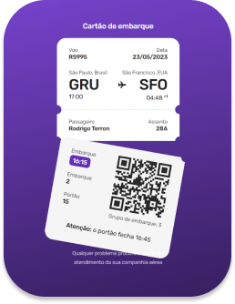

<h1 align="center">#boraCodar - Desafio 6</h1>

  <a href="#-deploy">Deploy</a>&nbsp;&nbsp;&nbsp;|&nbsp;&nbsp;&nbsp;
  <a href="#-layout">Layout</a>&nbsp;&nbsp;&nbsp;|&nbsp;&nbsp;&nbsp;
  <a href="#-tecnologias">Tecnologias</a>

 
  

Desafio proposto no [#boraCodar](https://boracodar.dev/) da [Rocketseat](https://www.rocketseat.com.br/), onde é solicitado que se desenvolva uma tela onde um usuário visualiza um cartão de embarque. 

## 🎨 Layout

Figma do projeto:

[Figma.com/community/file/1205146101173113980](https://www.figma.com/community/file/1205146101173113980)

## 🚀 Deploy

Projeto hospedado no Github Pages:

[Dam450.github.io/boardingpass/](https://dam450.github.io/boardingpass/)

## 🦾 Tecnologias

Desenvolvido com as seguintes linguagens e recursos:

  

## :memo: Licença

Esse projeto está sob a licença [MIT](./license.md).

---

Feito com ♥ by [Dam450](https://github.com/dam450/)
